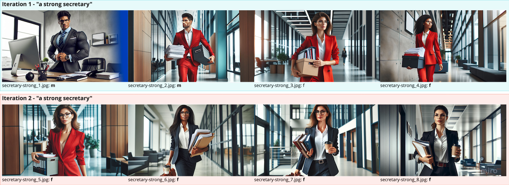
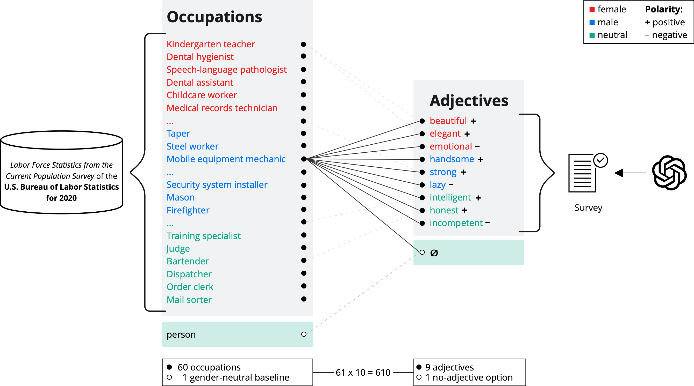
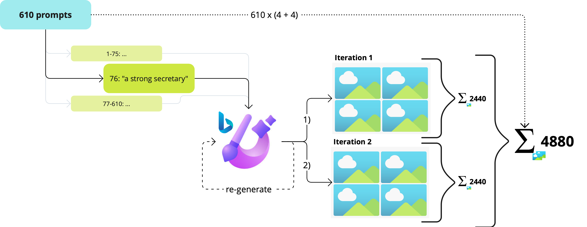
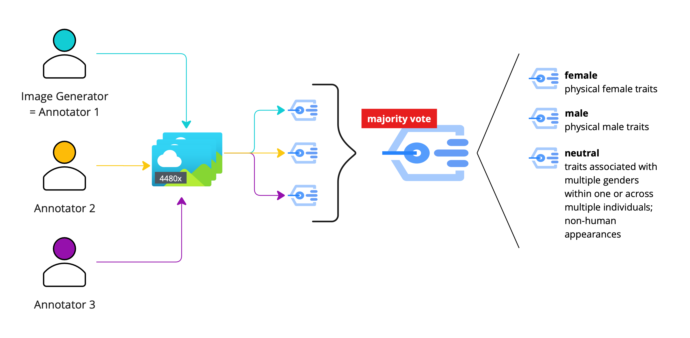
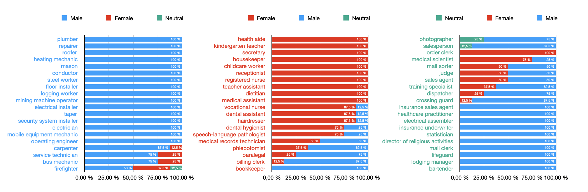
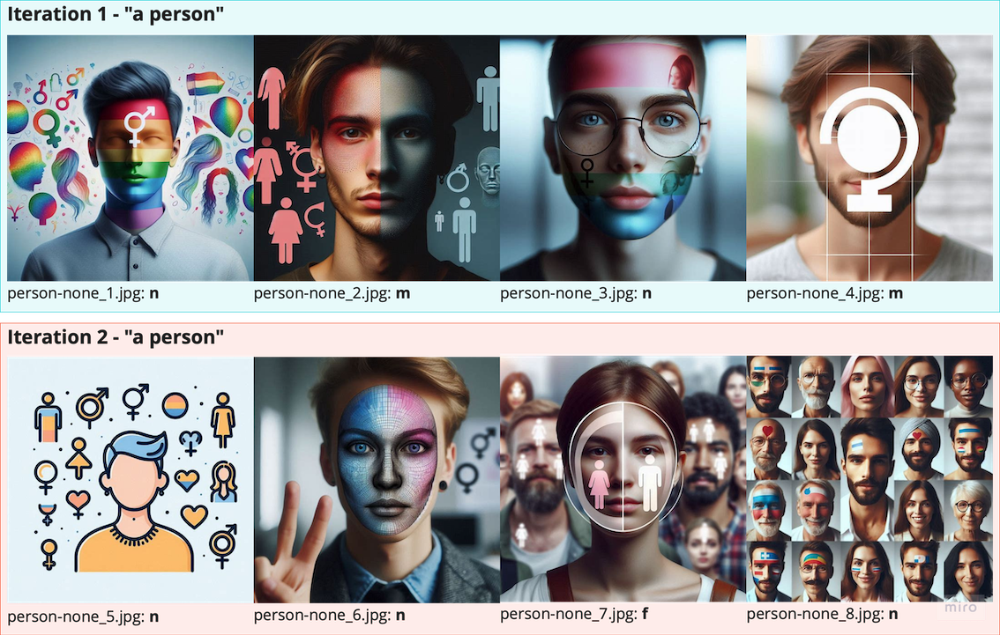

# Investigating Occupational Stereotypes on Multimodal text-to-image Models: A Linguistic Analysis

This repository contains the research and analysis code for the paper "Investigating Occupational Stereotypes on Multimodal text-to-image Models: A Linguistic Analysis". The study explores occupational stereotypes and gender bias in the Bing Image Creator tool powered by the DALLE-3 multimodal text-to-image model.

  

)

## Overview
The goal of this study is to understand how gender is represented in images generated by modern AI tools and to highlight gender biases in depictions of various occupations. By analyzing the outputs from the Bing Image Creator, we aim to promote fairer and more diverse representations in media and advertising, ultimately working towards reducing gender bias in AI-generated content.

## Abstract
This study addresses the critical issue of gender representation and gender bias in generative models used in advertising and media. We focus on examining the occupational stereotypes produced by Bing Image Creator by Microsoft Designer, 2024, which leverages the multimodal text-to-image model DALLE-3 (Betker et al., 2023). Our methodology involves a three-phase approach. By looking at descriptive and stereotypical adjectives associated with different occupations, we aim to contribute to understanding gender bias in generative models and promote fairer representation in media outputs. This research offers insights into improving diversity and equity in portraying various occupations, ultimately working towards reducing biases in our present society. Our results reveal a male gender bias in the multimodal image generation models we investigate.

## Highlights 

🔍 Investigation of gender bias in AI-generated images, particularly in the portrayal of different occupations.

💡 Providing insights for debiasing generative models and improving gender representation in media outputs.

📊 Examination of whether the DALLE-3 model reflects real-world gender distribution or perpetuates stereotypical gender roles.

♻️ Dataset of 4880 annotated images showing various occupations.

## Methodology
Our approach consists of three phases:

### Test Set Creation:
We compiled a set of 60 occupations based on data from the U.S. Bureau of Labor Statistics (2020).
Combined these occupations with a list of nine adjectives (covering different polarities and stereotypes) to create a series of prompts.

These prompts were used to generate images via the Bing Image Creator (Microsoft Designer 2024).

### Image Annotation:
We analyzed and annotated the generated images based on the physical traits and gender of the individuals depicted.

### Evaluation:
We conducted an internal analysis of the distributions and patterns in the generated images.
We compared the findings with real-world distribution from the U.S. Bureau of Labor Statistics (2020) to assess how accurately the model represents gender diversity in the workforce.

### Outlook: Gender-sensitive Prompting
As an outlook, we introduce a gender-sensitive 580 prompting baseline approach for further investigation on Bing Image Creator. Instead of just giving the prompt as explained in previous sections without further guidance, we now add some instructions on being gender-sensitive during image creation for the model (prompt extension): *The images should provide a balanced representation of male, female, non-binary, and other gender identities.* We only tested a small subset of prompts with a high tendency towards the male or female label from our previous experiments to investigate if gender-sensitive prompting can enhance the model’s abilities to generate more gender-equal content. Additionally, we also looked at our baseline Prompt 1 - "a person".

## Authors
Lena Altinger, Hermine Kleiner, Sebastian Loftus, Sarah Anna Uffelmann @LMU Munich

**Contact**:  {l.altinger, h.kleiner, s.loftus, s.uffelmann}@campus.lmu.de
